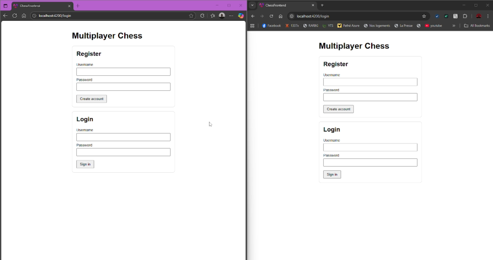

# Multiplayer Chess – Spring Boot + Angular

This project is a full-stack real-time **multiplayer chess** application built for a technical test.

- Backend: **Spring Boot 3**, **WebSockets (STOMP)**, **MySQL**, **JPA/Hibernate**
- Frontend: **Angular 18** (standalone components, fresh `@if` / `@for` syntax)
- Realtime sync: **WebSocket topic per game**
- Persistence: **MySQL** stores users, games, moves
- Tested with: **Java Runtime Environment 25**

---

## 📁 Project Structure

```
.
├─ chess-backend/     # Spring Boot (REST + WebSocket)
└─ chess-frontend/    # Angular SPA (login, lobby, board)
```

---

## ⚙️ Dependencies

### Backend
- Java **25 LTS**
- Spring Boot **3.x**
- Spring Web / Spring WebSocket / STOMP
- Spring Data JPA
- MySQL Connector/J
- Maven

### Frontend
- Node.js **18+**
- Angular **18**
- RxJS
- STOMP.js (`@stomp/stompjs`)

### Database
- MySQL **8+**
- Optional: phpMyAdmin

---
<h3>📹 Project Demo</h3>
[](./Video_dementration_Chess_Game_V1.webm)

---
## 🛠️ 1. Backend Setup (Spring Boot)

### 1.1 Create MySQL Database

```sql
CREATE DATABASE chess-backend
  CHARACTER SET utf8mb4
  COLLATE utf8mb4_unicode_ci;
```

### 1.2 Configure `application.properties`

Inside `chess-backend/src/main/resources/application.properties`:

```properties
server.port=8075

spring.datasource.url=jdbc:mysql://localhost:3306/chess?useSSL=false&serverTimezone=UTC
spring.datasource.username=YOUR_USERNAME
spring.datasource.password=YOUR_PASSWORD
spring.datasource.driver-class-name=com.mysql.cj.jdbc.Driver

spring.jpa.hibernate.ddl-auto=update
spring.jpa.show-sql=true
spring.jpa.properties.hibernate.format_sql=true
```

### 1.3 Run the Backend

```bash
cd chess-backend
mvn clean spring-boot:run
```

Backend is now available at:

- REST → `http://localhost:8075`
- WebSockets → `ws://localhost:8075/ws`

---

## 🖥️ 2. Frontend Setup (Angular)

### 2.1 Install Dependencies

```bash
cd chess-frontend
npm install
```

### 2.2 Static Assets (Sounds, Images)

Place your files inside:

```
chess-frontend/public/
```

Example:

```
public/sounds/movement_detected.mp3
```

Then in Angular:

```ts
new Audio('sounds/movement_detected.mp3');
```

### 2.3 Run Angular App

```bash
npm start
# or
ng serve
```

Frontend runs at:

➡️ **http://localhost:4200**

Make sure backend is already running.

---

## 🎮 3. How to Use the App

### 1) Open two browser windows:
- Browser A → `http://localhost:4200`
- Browser B → `http://localhost:4200`

### 2) Register or log in two different users  
Example:

- User 1: `elyes`
- User 2: `aymen`

### 3) Lobby  
- Each user sees the list of **online players** (except themselves)  
- Click **Invite** to challenge another user  
- The other user receives a popup: **Accept / Refuse**

### 4) Game  
- Once accepted → both users navigate to `/game/{id}`
- Real-time moves:
  - Local board updates immediately  
  - Move is saved in DB  
  - Move is pushed over WebSockets  
  - Opponent receives it instantly  

### 5) Resume Game  
Refreshing `/game/{id}`:
- Loads history from `/api/games/{id}/moves`
- Replays all moves to rebuild the board state

---

## 🧩 4. Key Backend Endpoints

### Auth
- `POST /api/auth/register`
- `POST /api/auth/login`

### Lobby
- `GET /api/lobby/online-users`

### Game
- `GET /api/games/{id}`
- `GET /api/games/{id}/moves`

### WebSocket Channels
- `/app/register-user`
- `/app/invite`
- `/app/invite-response`
- `/app/game/move`

### WebSocket Topics
- `/topic/online-users`
- `/topic/invitations.{userId}`
- `/topic/game.{gameId}`

---

## 🚀 5. Run Everything Together

1. Start MySQL  
2. Start backend:

```bash
cd chess-backend
mvn spring-boot:run
```

3. Start frontend:

```bash
cd chess-frontend
npm start
```

4. Open browser windows & play.

---

## 📌 Notes

- This is a **prototype**, not full chess rules.
- Movement is basic: no checkmate, castling, en passant, etc.
- Auth is minimal (just username + password, no JWT).
- Works fully with **Java 25**, Angular latest, MySQL 8.
